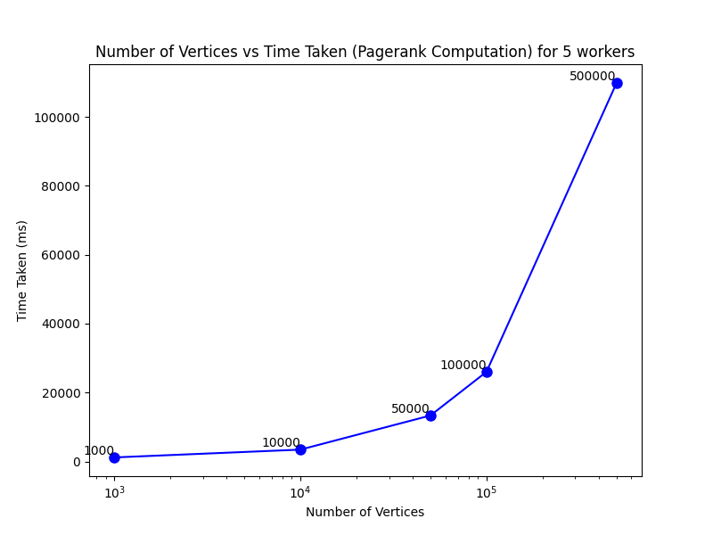

# Pregel: A System for Large-Scale Graph Processing (Dummy Implementation)

## Geetansh Juneja (2020CS50649), Hemank Bajaj (2020CS10349), Shivam Verma (2020CS50442)

[toc]

### A. INTRODUTION TO PREGEL

#### 1. Introduction

Pregel is a system designed for large-scale graph processing, developed by Google engineers. It's based on a vertex-centric programming model that simplifies the process of analyzing and processing vast amounts of graph data. Pregel allows for efficient computation on graphs with billions of vertices and edges, which are typical in various applications such as social networks, web graphs, and biological networks.

The system operates through a vertex-centric approach, where the user defines computation for each vertex. This model abstracts the complexities of parallel computation on distributed systems. Each vertex processes messages sent from other vertices, updating its state and sending messages to other vertices. The computation continues in iterations, where messages are exchanged until the algorithm converges.

*Google's implementation of Pregel was originally described in a paper titled "Pregel: A System for Large-Scale Graph Processing" by Grzegorz Malewicz, Matthew H. Austern, Aart J.C Bik, James C. Dehnert, Ilan Horn, Naty Leiser, and Grzegorz Czajkowski. (Link: https://dl.acm.org/doi/10.1145/1807167.1807184)*

#### 2. Pregel Model

Here's a breakdown of the key concepts and features of Pregel:

1. **Supersteps and Vertex-Centric Computation:**
    - Pregel computations operate in a series of iterations called "supersteps."
    - During a superstep, the system invokes a user-defined function for each vertex, conceptually in parallel.
    - The function describes the behavior at a single vertex for a specific superstep, including reading messages from the previous superstep, sending messages to other vertices for the next superstep, and modifying the state of the current vertex and its outgoing edges.
2. **Vertex-Centric Approach:**
    - Pregel focuses on local actions for each item (vertex), composing these actions to handle computation across a large dataset (the graph).
    - The model is well-suited for distributed implementations, as it abstracts the order of execution within a superstep and facilitates communication from one superstep to the next.
3. **Graph Structure and Initialization:**
    - Input to a Pregel computation is a directed graph where each vertex is uniquely identified by a string vertex identifier.
    - Vertices hold modifiable, user-defined values, and edges are associated with their source vertices, containing modifiable values and target vertex identifiers.
4. **Sequence of Computation and Termination Criteria:**
    - Pregel computations involve a sequence of supersteps separated by global synchronization points until the algorithm terminates.
    - Vertices compute in parallel within each superstep, potentially modifying their state, sending/receiving messages, or altering the graph's topology.
    - Algorithm termination occurs when all vertices simultaneously become inactive and no messages are in transit.
5. **Output and Flexibility:**
    - The output of a Pregel program consists of explicitly output values by the vertices.
    - The output might resemble the input directed graph, but the system allows for addition or removal of vertices and edges during computation.
    - This flexibility accommodates various types of graph algorithms, like clustering or graph mining, leading to diverse types of outputs.
6. **Pure Message Passing Model and Performance:**
    - Pregel employs a pure message-passing model, avoiding remote reads and shared memory emulation.
    - Message passing suffices for expressiveness in graph algorithms and enhances performance by amortizing latency through asynchronous batch message delivery.

These principles collectively illustrate how Pregel's vertex-centric model and message-passing system efficiently handle large-scale graph computations with scalability and performance in mind.

#### 3. Basic Architecture of Pregel

1. **Graph Partitioning:**
    - The Pregel library divides a graph into partitions, each containing a set of vertices and their outgoing edges. Vertex assignment to a partition depends on the vertex ID.
    - The default partitioning function is hash(ID) % N, but users can define custom assignment functions for specific requirements.
   
2. **Worker Machines:**
    - In Pregel, many copies of the user program execute on a cluster of machines, with one serving as the master responsible for coordinating worker activity.
    - The master determines the number of partitions and assigns them to each worker machine. Each worker maintains the state of its graph section and executes the user's Compute() method on its vertices.
   
3. **Input Loading and Vertex Activation:**
    - The master assigns portions of the user's input to each worker, treating the input as records containing vertices and edges.
    - Workers update their data structures immediately if a vertex belongs to their section; otherwise, they enqueue a message to the peer that owns the vertex. All vertices are marked as active after input loading.

4. **Execution of Supersteps:**
    - The master instructs each worker to perform a superstep, during which the worker processes its active vertices, calling the Compute() function.
    - Messages sent in the previous superstep are delivered asynchronously, allowing overlap of computation and communication. Workers respond to the master with the number of active vertices for the next superstep.
   
5. **Graph Saving:**
    - After computation halts, the master may instruct each worker to save its portion of the graph.

#### 4. Worker Implementation Details

1. **Worker State Maintenance:**
    - Each worker machine maintains its graph section in memory, essentially a map from vertex ID to vertex state, containing values, outgoing edges, incoming messages, and an active flag for each vertex.

2. **Superstep Execution and Message Handling:**
    - During a superstep, the worker loops through vertices, calling Compute() with the current value, incoming messages, and outgoing edges.
    - Messages between vertices are sent and buffered based on whether the destination vertex is owned by a remote worker or the same worker.
   
3. **Optimizations and Combiner Usage:**
    - For remote destinations, messages are buffered and flushed in batches to reduce communication overhead. In local cases, messages can be directly placed in the destination vertex's queue for optimization.
    - If a Combiner is provided by the user, it is applied when adding messages to outgoing queues and when messages are received at the incoming queue to reduce space needed for storage.

The detailed worker implementation and architecture ensure efficient graph processing, enabling distributed computation while handling data partitioning, message passing, and vertex state management.

---

### B. TECHNICAL SPECIFICATIONS

The Pregel framework was realized through a Python implementation. Our design adheres to a single-machine model wherein various distinct processes simulate individual workers. The principal Python process assumes the role of the master, overseeing and orchestrating the activities of these distinct worker processes.

To facilitate the exchange of messages, we employed Redis as a pivotal component within our system architecture. Workers utilize Redis for both reading and writing messages. Beyond its role in message transmission, Redis serves as a synchronization mechanism among the workers following the completion of each superstep. This facilitates an effective coordination and harmonization of computational activities among the worker processes.

---

### C: OUR DESIGN

#### 1. Master and Worker Implementation

**I. Input Graph Handling:**
- The Pregel class processes an input graph supplied as a list of vertices.
- Each vertex contains a unique identifier, a specific value, a list of connected vertex identifiers, and separate lists for incoming and outgoing messages.

**II. User-defined Functions and Initialization:**
- Users are required to define an `update()` function, designed to be executed on each active vertex during the course of supersteps.
- Invocation of the `run()` function activates the master, initiating the computational process.

**III. Initialization and Graph Partitioning:**
- The master node establishes a connection with a Redis server at port 6379 and proceeds to partition the input graph.
- For 'n' workers, the input graph is segmented into 'n' partitions, stored as a mapping of lists indexed by worker IDs. Each list contains vertices allocated to a specific worker.

**IV. Worker Processes and Superstep Execution:**
- The master creates 'n' worker processes, assigning one partition to each worker.
- Workers establish connections with the Redis server and execute supersteps in parallel.
- During a superstep, each worker iterates through the vertices within its partition, retrieving incoming messages from Redis sent by other vertices in previous supersteps. It then executes the user-defined `update()` function on active vertices.

**V. Message Passing and Coordination:**
- Upon completing the computation for each vertex in its partition, workers initiate message passing.
- Outgoing messages from vertices in a partition are sent to the Redis server for the destination worker to receive in the subsequent superstep, orchestrating message transfers between workers.

**VI. Utilization of Redis for Synchronization:**
- Redis serves an additional purpose of implementing barriers within worker processes.
- Each superstep involves a variable in Redis initialized to 0. Workers increment this variable by 1 and wait until the total reaches the number of workers, ensuring synchronization among the worker processes.

**VII. Graph Finalization and Output:**
- Upon the inactivity of vertices in all partitions, workers conclude their tasks and save their respective portions of the graph.
- Workers gracefully exit, and the master consolidates the final graph, returning this comprehensive graph as the output to the user.

#### 2. Fault Tolerence

**1. Check how many processes have died and have completed:**

Monitor the health and status of worker processes. Periodically check the status of each worker to determine if any processes have terminated or completed their tasks. 

**2. Kill all the alive workers:**

In the event of failures or completion of tasks, terminate all currently running worker processes to prepare for the system's recovery. This step ensures a clean state for the subsequent restart and redistribution of tasks.

**3. Read the checkpoint files to get the last checkpoint data:**

Checkpoint files store the state or progress of the system at certain intervals. Upon failure or termination of processes, retrieve the latest checkpoint data to re-establish the system's state. 

**4. Redistribute the partition to the live workers:**

Reallocate or redistribute the tasks, partitions, or workload among the surviving, active worker processes. Ensure that the tasks previously handled by failed or completed workers are reassigned to the available worker processes to maintain the system's progress.

**5. Update the state of all the vertices:**

Update the state of the vertices or entities that were being processed by the failed workers. This involves restoring the state from the checkpoint data and applying any necessary modifications to account for the work already completed before the failure.

**6. Restart the alive workers:**

Initiate the restart process for the surviving worker processes. This includes spawning new worker processes, initializing them, and assigning them the redistributed tasks or partitions to resume the system's operation from the last checkpointed state.

This fault-tolerance strategy aims to maintain system resilience in the face of worker process failures or terminations by recovering the system state from the last known consistent state (checkpoint) and resuming operations with the remaining active worker processes.

---

### C. RESULTS AND CHALLENGES

1. **Total Runtime vs Number of Vertices in Input Graph for Page Rank Computation using Pregel using 6 workers**

The following plot illustrates the relationship between the total runtime and the number of vertices in the input graph for the Page Rank computation using Pregel. The data represents the computational time required for different sizes of input graphs used in the Page Rank algorithm. The x-axis represents the number of vertices in the graph, while the y-axis shows the total runtime in milliseconds. The plot highlights how the runtime varies concerning the graph's size, providing insights into the computational performance of the Page Rank algorithm with varying input graph sizes.

**Observation**: In our observation, a noticeable trend emerges as the runtime escalates in conjunction with the increasing number of vertices in the input graph, while employing 6 worker processes. Notably, the computational bottleneck did not stem from the `compute` function executed on each vertex. Instead, the primary impediment to computational efficiency was the inter-worker communication subsequent to each superstep. As the volume of vertices within the input dataset expanded, the temporal resources allocated to managing communication and message passing substantially increased.

The orchestration of message transfers via Redis, while integral to our implementation, posed challenges in emulating the precise outcomes outlined in the official Pregel model. Within a multi-machine framework, messages are dispatched asynchronously, facilitating concurrent computation and communication overlap, as well as batching, while ensuring their delivery prior to the termination of the superstep. However, within our singular machine implementation, managing the intricacies of message transfers presented a non-trivial task.

Our implementation's core architecture and principles remain in line with the Pregel paper, ensuring that we adhere to its fundamental concepts while adapting to the specific requirements of our single-machine environment.

2. **Total Runtime vs Number of Workers for Page Rank Computation using Pregel with 5000 Vertices**

The presented plot exhibits the correlation between the total runtime and the number of workers employed for the Page Rank computation using Pregel when the input graph contains 5000 vertices. This graphical representation demonstrates the relationship between the computational time and the variation in the number of workers involved in the execution of the Page Rank algorithm. The x-axis represents the number of workers utilized in the computation, while the y-axis displays the total runtime in milliseconds. The plot serves to elucidate the impact of altering the workforce on the computational efficiency of the Page Rank algorithm specifically for an input graph consisting of 5000 vertices.

**Observation**: The depicted trend demonstrates a clear inverse relationship between the total runtime and the number of workers utilized in the Page Rank computation using Pregel with an input graph containing 5000 vertices. As the number of workers increases, the total runtime of the computation decreases. This decline in runtime is a desirable outcome, signifying the advantage of distributing the workload among multiple workers, thus enabling concurrent processing.

The reduction in total runtime with an increased number of workers signifies enhanced parallelism, allowing tasks to be executed concurrently. With more workers, each process is assigned a smaller partition, enabling them to handle tasks more efficiently in parallel.

However, it's important to note that in a single-machine implementation, a threshold exists. Beyond a certain point—typically when the number of workers exceeds the available cores, as in an 8-core CPU—the benefits of increasing workers diminish. In such cases, the runtime may increase due to the overhead involved in managing a higher number of processes, ultimately offsetting the advantages of parallelism. Therefore, there's a point where adding more workers no longer decreases the runtime and might even increase it due to management overhead.

#### Major Roadblocks

1. **Distributed Computing Complexity:**
   Implementing a distributed computing model like Pregel on a single machine poses inherent complexity, especially in handling inter-process communication and synchronization.
2. **Efficient Message Passing and Synchronization:**
   Ensuring smooth and efficient message passing between workers and synchronization for supersteps was challenging. Coordinating message exchange while maintaining performance required careful design and optimization. After many thought and discussion we planned to use Redis for the same.
3. **Redis Integration:**
   Incorporating and maintaining Redis for communication and synchronization posed some challenges. Configuring Redis for effective message handling and barrier implementation required good understanding of the tool and efficient handling to avoid bottlenecks or data inconsistencies.
4. **Fault Tolerance and Error Handling:**
   Implementing fault-tolerant mechanisms to handle processes failures or errors during the computation was not trivial. Ensuring the integrity of the computation and data while handling potential failures was likely a considerable challenge.

---

### D. INDIVADUAL CONTRIBUTION & FUTURE WORK

*Here is the link of GitHub repo: https://github.com/Shivam5022/Google-Pregel-Implemetation/tree/main*

#### 1. Shivam Verma (2020CS50442)

- Developed the fundamental architecture of the model, initially excluding Fault Tolerance.
- Conducted rigorous testing of the model using various user programs to validate its functionality and performance.

#### 2. Geetansh Juneja (2020CS50649)

- Integrated Fault Tolerance mechanisms into the system to enhance its resilience.
- Engaged in comprehensive analysis and visualization of results, effectively plotting and interpreting the generated outputs.

#### 3. Hemank Bajaj (2020CS10349)

- Implemented aggregators and additional functions within the system, enhancing its computational capabilities.
<<<<<<< Updated upstream
- Contributed to establishing synchronization protocols between workers during the superstep execution, ensuring effective coordination in the distributed environment.
=======
- Contributed to establishing synchronization protocols between workers during the superstep execution, ensuring effective coordination in the distributed environment.
>>>>>>> Stashed changes
